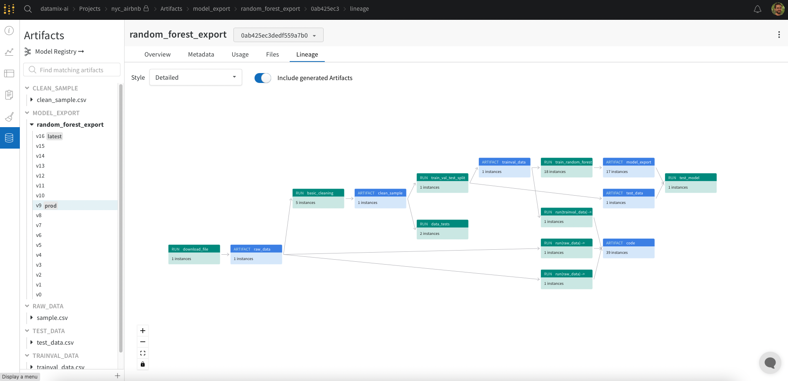

# Reproducible Machine Learning Pipeline for Short-Term Rental Price Prediction

This repository contains a Machine Learning (ML) pipeline which is able to predict short-term rental property prices in New York City. The pipeline is designed to the retrained easily with new data that comes frequently in bulk, assuming that prices (and thus, the model) vary constantly. The pipeline is divided into the typical steps or components in an ML training pipeline, carried out in order, and explained in the section [Introduction](#introduction).

The following tools are used:

- [MLflow](https://www.mlflow.org) for reproduction and management of pipeline processes.
- [Weights and Biases](https://wandb.ai/site) for artifact and execution tracking.
- [Hydra](https://hydra.cc) for configuration management.
- [Conda](https://docs.conda.io/en/latest/) for environment management.
- [Pandas](https://pandas.pydata.org) for data analysis.
- [Scikit-Learn](https://scikit-learn.org/stable/) for data modeling.

The starter code of the repository was originally forked from a project in the Udacity repository [build-ml-pipeline-for-short-term-rental-prices](https://github.com/udacity/build-ml-pipeline-for-short-term-rental-prices). The instructions of that source project can be found in the file [`Instructions.md`](Instructions.md). If you would like to know more about *why* reproducible ML pipelines matter and *how* the tools used here interact, you can have a look at my [ML pipeline project boilerplate](https://github.com/mxagar/music_genre_classification).

The used dataset is a modified [AirBnB dataset for New York City](http://insideairbnb.com/get-the-data/), which is in the source [forked repository](https://github.com/udacity/build-ml-pipeline-for-short-term-rental-prices/tree/main/components/get_data/data). AirBnB has a [data dictionary](https://docs.google.com/spreadsheets/d/1iWCNJcSutYqpULSQHlNyGInUvHg2BoUGoNRIGa6Szc4/edit#gid=1322284596) which explains each feature. A subset of 15 independent variables has has been taken.

Table of contents:

- [Reproducible Machine Learning Pipeline for Short-Term Rental Price Prediction](#reproducible-machine-learning-pipeline-for-short-term-rental-price-prediction)
  - [Introduction](#introduction)
  - [How to Use This Project](#how-to-use-this-project)
  - [Dependencies](#dependencies)
  - [Notes](#notes)
  - [Tips & Tricks](#tips--tricks)
    - [Issues](#issues)
  - [Possible Improvements](#possible-improvements)
  - [Interesting Links](#interesting-links)
  - [Authorship](#authorship)

## Introduction

Contents:

    conda env create
    cookiecutter
    single steps/components
    pre-existing components run from github
      get_data
      train_val_test_split
      test_regression_model

Note that the data processing and modeling are quite simple; the focus of the project lies on the MLOps aspect.



```bash
mlflow run https://github.com/mxagar/ml_pipeline_rental_prices.git \
-v 1.0.0 \
-P hydra_options="etl.sample='sample2.csv'"
```

## How to Use This Project

- [`Instructions.md`](Instructions.md)
- [ML pipeline project boilerplate](https://github.com/mxagar/music_genre_classification).

## Dependencies

## Notes

## Tips & Tricks

### Issues

- I changed the remote component folder/URL; additionally, we might need to specify the branch with the parameter `version` in the `mlflow.run()` call, because `mlflow` defaults to use `master`.
- I had to change several `conda.yaml` files to avoid versioning/dependency issues; protobuf, pyarrow, etc.

## Possible Improvements

## Interesting Links

- [ML pipeline project boilerplate](https://github.com/mxagar/music_genre_classification).
- This repository doesn't focus on the techniques for data processing and modeling; if you are interested in those topics, you can visit my  [Guide on EDA, Data Cleaning and Feature Engineering](https://github.com/mxagar/eda_fe_summary).
- This project creates an inference pipeline managed with [MLflow](https://www.mlflow.org) and tracked with [Weights and Biases](https://wandb.ai/site); however, it is possible to define a production inference pipeline in a more simple way without the exposure to those 3rd party tools. In [this blog post](https://mikelsagardia.io/blog/machine-learning-production-level.html) I describe how to perform that transformation from research code to production-level code; the associated repository is [customer_churn_production](https://github.com/mxagar/customer_churn_production).
- If you are interested in more MLOps-related content, you can visit my notes on the [Udacity Machine Learning DevOps Engineering Nanodegree](https://www.udacity.com/course/machine-learning-dev-ops-engineer-nanodegree--nd0821): [mlops_udacity](https://github.com/mxagar/mlops_udacity).
- If you're interested in such short-term renting price modeling, have a look at my [Analysis and Modelling of the AirBnB Dataset from the Basque Country](https://mikelsagardia.io/blog/airbnb-spain-basque-data-analysis.html).
- [Weights and Biases tutorials](https://wandb.ai/site/tutorials).
- [Weights and Biases documentation](https://docs.wandb.ai/).

## Authorship

Mikel Sagardia, 2022.  
No guarantees.

If you find this repository helpful and use it, please link to the original source.
