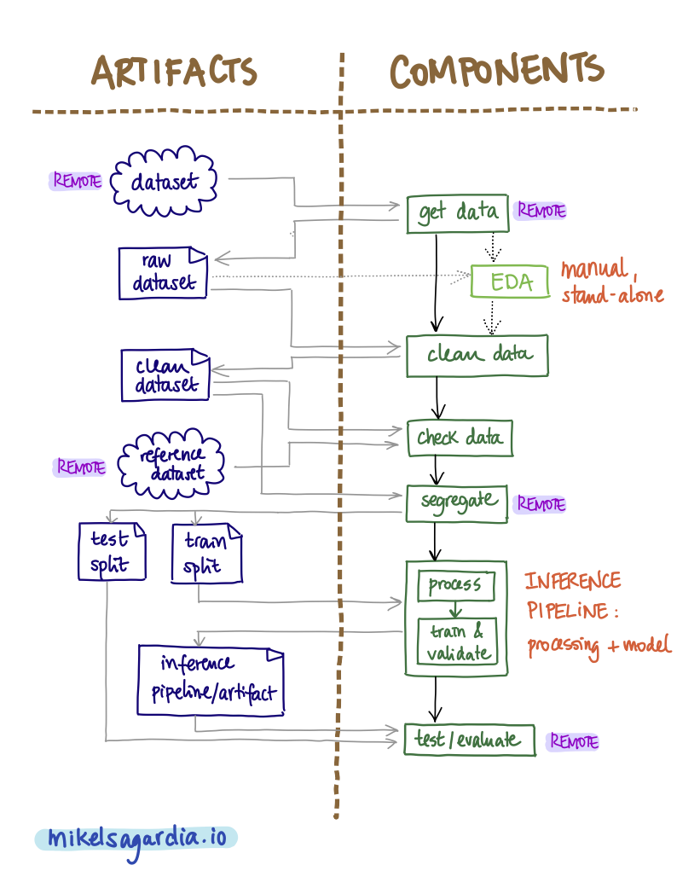

# Reproducible Machine Learning Pipeline for Short-Term Rental Price Prediction

This repository contains a Machine Learning (ML) pipeline which is able to predict short-term rental property prices in New York City. It is designed to be retrained easily with new data that comes frequently in bulk, assuming that prices (and thus, the model) vary constantly. The pipeline is composed by the typical steps or components from short/medium-size projects; these are explained in the section [Introduction](#introduction).

The following tools are used:

- [MLflow](https://www.mlflow.org) for reproduction and management of pipeline processes.
- [Weights and Biases](https://wandb.ai/site) for artifact and execution tracking.
- [Hydra](https://hydra.cc) for configuration management.
- [Conda](https://docs.conda.io/en/latest/) for environment management.
- [Pandas](https://pandas.pydata.org) for data analysis.
- [Scikit-Learn](https://scikit-learn.org/stable/) for data modeling.

The **Weights & Biases project which collects the tracked experiments can be found here: [nyc_airbnb](https://wandb.ai/datamix-ai/nyc_airbnb)**.

The starter code of the repository was originally forked from a project in the Udacity repository [build-ml-pipeline-for-short-term-rental-prices](https://github.com/udacity/build-ml-pipeline-for-short-term-rental-prices). The instructions of that source project can be found in the file [`Instructions.md`](Instructions.md). If you would like to know more about *why* reproducible ML pipelines matter and *how* the tools used here interact, you can have a look at my [ML pipeline project boilerplate](https://github.com/mxagar/music_genre_classification).

The used dataset is a modified [AirBnB dataset for New York City](http://insideairbnb.com/get-the-data/), which is in the source [forked repository](https://github.com/udacity/build-ml-pipeline-for-short-term-rental-prices/tree/main/components/get_data/data). AirBnB has a [data dictionary](https://docs.google.com/spreadsheets/d/1iWCNJcSutYqpULSQHlNyGInUvHg2BoUGoNRIGa6Szc4/edit#gid=1322284596) which explains each feature. A subset of 15 independent variables has has been taken.

Table of contents:

- [Reproducible Machine Learning Pipeline for Short-Term Rental Price Prediction](#reproducible-machine-learning-pipeline-for-short-term-rental-price-prediction)
  - [Introduction](#introduction)
  - [How to Use This Project](#how-to-use-this-project)
    - [Dependencies](#dependencies)
    - [How to Run the Pipeline](#how-to-run-the-pipeline)
    - [How to Modify the Pipeline](#how-to-modify-the-pipeline)
  - [Issues / Notes](#issues--notes)
  - [Possible Improvements](#possible-improvements)
  - [Interesting Links](#interesting-links)
  - [Authorship](#authorship)

## Introduction

The following figure summarizes all the steps/components and the artifacts of the pipeline:

<p align="center">

</p>

The final goal of the pipeline is to produce the optimal inference artifact which is able to regress the price of a rented unit given its features.

The step related to the Exploratory Data Analysis (EDA) in light green is not part of the re-trainable pipeline, i.e., it needs to be called explicitly; additionally, the component contains research notebooks that are crafted manually to gather insights of the dataset. Note that the data processing and modeling are quite simple; the focus of the project lies on the MLOps aspect.

Some components and artifacts have been labeled as *remote*. Even though they are locally available in this repository, they are fetched from the original repository, showing that MLflow capability.

The file and folder structure reflects the diagram above:

```
.
├── README.md                       # This file
├── MLproject                       # High-level pipeline project
├── main.py                         # Pipeline main file
├── environment.yml                 # Environment to run the project
├── conda.yml                       # Environment of main pipeline
├── config.yaml                     # Configuration of pipeline
├── Instructions.md                 # Original instructions by Udacity
├── LICENSE.txt
├── images/                         # Markdown assets
│   └── ...
├── cookie-mlflow-step/             # Template for (empty) step generation
│   └── ...
├── components/                     # Remote components
│   ├── README.md
│   ├── conda.yml
│   ├── get_data/                   # Download/get data step/component
│   │   ├── MLproject               # MLflow project file
│   │   ├── conda.yml               # Environment for step
│   │   ├── data/                   # Dataset samples (retrieved with URL)
│   │   │   ├── sample1.csv
│   │   │   └── sample2.csv
│   │   └── run.py                  # Step implementation
│   ├── test_regression_model/      # Evaluation step/components
│   │   ├── MLproject
│   │   ├── conda.yml
│   │   └── run.py
│   └── train_val_test_split/       # Segregation step/component
│       ├── MLproject
│       ├── conda.yml
│       └── run.py
└── src/                            # Local components
    ├── README.md
    ├── basic_cleaning/             # Cleaning step/component
    │   ├── MLproject               # MLflow project file
    │   ├── conda.yml               # Environment for step
    │   └── run.py                  # Step implementation
    ├── data_check/                 # Non-/Deterministic tests step/component
    │   ├── MLproject
    │   ├── conda.yml
    │   ├── conftest.py
    │   └── test_data.py
    ├── eda/                        # Exploratory Data Analysis & Modeling (research env.)
    │   ├── EDA.ipynb               # Basic EDA notebook
    │   ├── MLproject
    │   ├── Modeling.ipynb          # Modeling trials, transferred to train_random_forest
    │   └── conda.yml
    └── train_random_forest/        # Inference pipeline
        ├── MLproject
        ├── conda.yml
        ├── feature_engineering.py
        └── run.py

```

Each step/component has a dedicated folder with the following files:

- `run.py`: The implementation of the step function/goal.
- `MLproject`: The MLflow project file which executes `run.py` with the proper arguments.
- `conda.yaml`: The conda environment required by `run.py` which is set by MLflow.

All the components are controlled by the root-level script [`main.py`](main.py); that file executes all the steps in order and with the parameters specified in [`config.yaml`](config.yaml).

## How to Use This Project

0. If you're unfamiliar with the tools used in this project, I recommend you to have a look at my [ML pipeline project boilerplate](https://github.com/mxagar/music_genre_classification).
1. Install the [dependencies](#dependencies).
2. Run the pipeline as explained in [the dedicated section](#how-to-run-the-pipeline).
3. You can modify the pipeline following [these guidelines](#how-to-modify-the-pipeline) and having into account the original [`Instructions.md`](Instructions.md). 

### Dependencies

In order to set up the main environment from which everything is launched you need to install [conda](https://docs.conda.io/en/latest/) and create a [Weights and Biases](https://wandb.ai/site) account; then, the following sets everything up:

```bash
# Clone repository
git clone git@github.com:mxagar/ml_pipeline_rental_prices.git
cd ml_pipeline_rental_prices

# Create new environment
conda env create -f environment.yml

# Activate environment
conda activate nyc_airbnb_dev

# Log in via the web interface
wandb login
```

All step/component dependencies are handled by MLflow using the dedicated `conda.yaml` environment definition files.

### How to Run the Pipeline

There are multiple ways of running this pipeline, for instance:

- Local execution or execution from cloned source code of the complete pipeline.
- Local execution of selected pipeline steps.
- Remote execution of a release.

In the following, some example commands that show how these approaches work are listed:

```bash
# Go to the root project level, where main.py is
cd ml_pipeline_rental_prices

# Local execution of the entire pipeline
mlflow run . 

# Step execution: Download or get the data
# Step name can be found in main.py
# This step uses the code in a remote repository
mlflow run . -P steps="download"

# Step execution: Clean / pre-process the raw dataset
# Step name can be found in main.py
# Note that any upstream artifacts need to be available
mlflow run . -P steps="basic_cleaning"

# Step execution: data check + segregation
# Step names can be found in main.py
# Note that any upstream artifacts need to be available
# The step data_split uses the code in a remote repository
mlflow run . -P steps="data_check,data_split"

# Hyperparameter variation with hydra sweeps
# Step execution: Train the random forest model
# Step names can be found in main.py
# Note that any upstream artifacts need to be available
mlflow run . \
-P steps=train_random_forest \
-P hydra_options="modeling.max_tfidf_features=10,15,30 modeling.random_forest.max_features=0.1,0.33,0.5,0.75,1.0 -m"

# Execution of a remote release hosted in my repository
# and use a different dataset/sample from the standard one
# Release: 1.0.1
mlflow run https://github.com/mxagar/ml_pipeline_rental_prices.git \
-v 1.0.1 \
-P hydra_options="etl.sample='sample2.csv'"
```

Note that any execution generates, among others:

- Auxiliary tracking files and folders that we can ignore: `wandb`, `mlruns`, `artifacts`, etc.
- Entries in the associated [Weights and Biases project](https://wandb.ai/datamix-ai/nyc_airbnb).

The entries in the [Weights and Biases web interface](https://wandb.ai/datamix-ai/nyc_airbnb) cover extensive information related to each run of a component or uploaded/downloaded artifacts:

- Time, duration and resources.
- Logged information: parameters, metrics, images, etc.
- Git commit branches.
- Relationship between components and artifacts.
- Etc.

As an example, here is a graph view of the lineage of the pipeline, which resembles the pipeline flow diagram shown above:


### How to Modify the Pipeline

We can generate new steps/components easily by creating a new folder under `src/` with the following three files, properly implemented:

- `MLproject`
- `conda.yaml`
- `run.py`

Then, we need to add the step and its parameters to the `mlflow` pipeline in [`main.py`](main.py), as it is done with the other steps.

Instead of creating the folder and the files manually, we can use the tool [cookiecutter](https://github.com/cookiecutter/cookiecutter), installed with the general requirements. For that, we run the following command:

```bash
cookiecutter cookie-mlflow-step -o src
```

That prompts a form we need to fill in via the CLI; for instance, if we'd like to create a new component which would train an [XGBoost](https://xgboost.ai) model, we could write this:

```bash
step_name [step_name]: train_xgboost
script_name [run.py]: run.py
job_type [my_step]: train_model
short_description [My step]: Training of an XGBoost model
long_description [An example of a step using MLflow and Weights & Biases]: Training of an XGBoost model
parameters [parameter1,parameter2]: trainval_artifact,val_size,random_seed,stratify_by,xgb_config,max_tfidf_features,output_artifact  
```

All that creates the component folder with the three files, to be implemented.

## Issues / Notes

There are some deviations from the original [`Instructions.md`](Instructions.md) that might be worth considering:

- I changed the remote component folder/URL; additionally, we might need to specify the branch with the parameter `version` in the `mlflow.run()` call, because `mlflow` defaults to use `master`.
- I had to change several `conda.yaml` files to avoid versioning/dependency issues: `protobuf`, etc.

## Possible Improvements

- [ ] Extend the Exploratory Data Analysis (EDA) and the Feature Engineering (FE). See my [Guide on EDA, Data Cleaning and Feature Engineering](https://github.com/mxagar/eda_fe_summary).
- [ ] Extend the current data modeling and the hyperparameter tuning.
- [ ] Try other models than the random forest: create new components/steps for those and compare them.

## Interesting Links

- [Reproducible ML pipeline boilerplate](https://github.com/mxagar/music_genre_classification).
- This repository doesn't focus on the techniques for data processing and modeling, instead it focuses on the MLOps aspect; if you are interested in the former topics, you can visit my  [Guide on EDA, Data Cleaning and Feature Engineering](https://github.com/mxagar/eda_fe_summary).
- This project creates an inference pipeline managed with [MLflow](https://www.mlflow.org) and tracked with [Weights and Biases](https://wandb.ai/site); however, it is possible to define a production inference pipeline in a more simple way without the exposure to those 3rd party tools. In [this blog post](https://mikelsagardia.io/blog/machine-learning-production-level.html) I describe how to perform that transformation from research code to production-level code; the associated repository is [customer_churn_production](https://github.com/mxagar/customer_churn_production).
- If you are interested in more MLOps-related content, you can visit my notes on the [Udacity Machine Learning DevOps Engineering Nanodegree](https://www.udacity.com/course/machine-learning-dev-ops-engineer-nanodegree--nd0821): [mlops_udacity](https://github.com/mxagar/mlops_udacity).
- If you're interested in such short-term renting price modeling, have a look at my [Analysis and Modelling of the AirBnB Dataset from the Basque Country](https://mikelsagardia.io/blog/airbnb-spain-basque-data-analysis.html).
- [Weights and Biases tutorials](https://wandb.ai/site/tutorials).
- [Weights and Biases documentation](https://docs.wandb.ai/).

## Authorship

Mikel Sagardia, 2022.  
No guarantees.

If you find this repository helpful and use it, please link to the original source.
